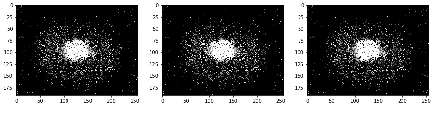
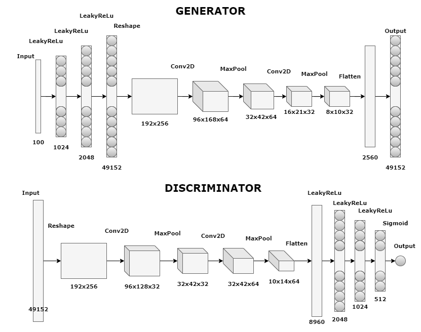
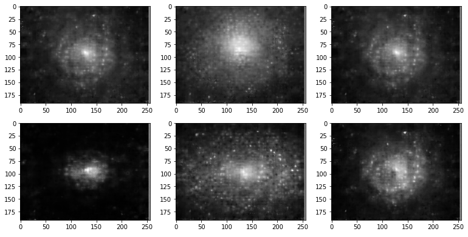
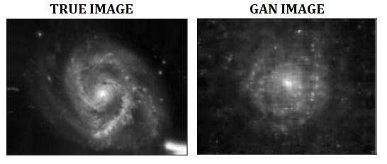

# GALAXY GAN - Create your galaxy

This project was made for educational purposes during which I experimented with GAN networks.

Fascinated by the theory of GAN networks, I decided to check if I could create a simple generative network. After reading a few articles, especially https://arxiv.org/abs/1406.2661, I started experimenting (mostly by trial and error) with generator and discriminator architectures. The network architecture used here does not come from any articles, it is only the result of experiments, and there is probably a much better method. However, this project is all about _"playing"_ with GAN networks.

### Data
It so happened that my interest in GAN networks coincided with my interest in astronomy. So I thought that I would like my GAN to produce galaxy images.

The data, i.e. color photos of galaxies, used in this project come from the website https://esahubble.org from where they were downloaded and then scaled to the size of 192x256.
Unfortunately, the number of downloaded images was very small, so in the next step Image Augmentation was used to artificially enlarge the data set. Images were artificially generated by rotating, shifting and reflecting. Ultimately, the dataset on which the GAN was trained included 2880 images, of which only 90 images represent various deep sky objects. Due to such a small set of data, I believe that the obtained results are surprisingly good, and with more data and greater hardware capabilities, a much better effect could be achieved.

### The beginnings...
At the beginning, I tried to use the entire 3 RGB channels, unfortunately the data set turned out to be too small to obtain satisfactory results. As a result, the images have been converted to grayscale.

The first approach consisted of only dense layers, which arranged ascendingly in the generator and descending in the discriminator did not give what I wanted to get. The results looked something like this:

I came up with the idea to use convolutional networks (I haven't studied DCGAN before, so my attempts may not be very successful). Although the effect is still far from ideal, the convolution layers have significantly improved the images of galaxies produced by GAN.

Perhaps when I have the time or need to further explore the GANs, I will try to build a better network. In the meantime, however, I am leaving here what I have managed to do so far.

### GAN architecture

### GAN results
Below are some examples of galaxy images created by our GAN network:

### Expectations vs Reality
For comparison, I present photo from training dataset and the results of my GAN network.
 
 

I encourage you to play with GAN networks!
